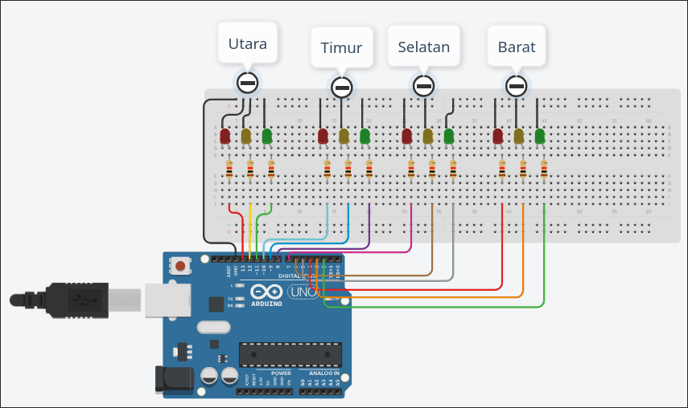

# Traffic Light (4 way)

## overview

Project ini mensimulasikan lampu lalu lintas pada persimpangan 4 arah. Setiap arah memiliki 3 LED. Merah, kuning, hijau. Sistem bekerja bergiliran searah jarum jam. Utara, Timur, Selatan, Barat. Tidak ada dua lampu hijau aktif bersamaan.

## Alat dan bahan

Alat dan bahan yang diperlukan:

- Arduino
- Breadboard
- 4 led merah, kuning dan hijau
- 12 resistor (untuk mengamankan lampu)
- kabel jumper

## Schema

Mapping pin Arduino :

- Utara: merah 13, kuning 12, hijau 11
- Timur: merah 10, kuning 9, hijau 8
- Selatan: merah 7, kuning 6, hijau 5
- Barat: merah 4, kuning 3, hijau 2

## Alur kerja sistem

Urutan aktif
Utara → Timur → Selatan → Barat → ulangi.

- Saat awal, semua lampu merah menyala.
- Satu arah dipilih. Lampu merah arah tersebut dimatikan.
- Lampu kuning berkedip 3 kali selama sekitar 2 detik.
- Lampu hijau menyala selama 5 detik.
- Setelah selesai, lampu kembali merah.
- Proses lanjut ke arah berikutnya.

## Logika program

Semua LED merah dinyalakan di awal.
Fungsi light(red, yellow, green) mengatur satu arah aktif.

Langkah dalam fungsi:

- Nyalakan semua merah.
- Matikan merah pada arah aktif.
- Kedipkan kuning 3 kali.
- Nyalakan hijau 5 detik.
- Kembali ke merah.

Loop utama memanggil fungsi light sesuai urutan arah.

### Catatan implementasi

> Resistor dipasang seri dengan setiap LED untuk membatasi arus.
Semua GND LED terhubung ke GND Arduino.
